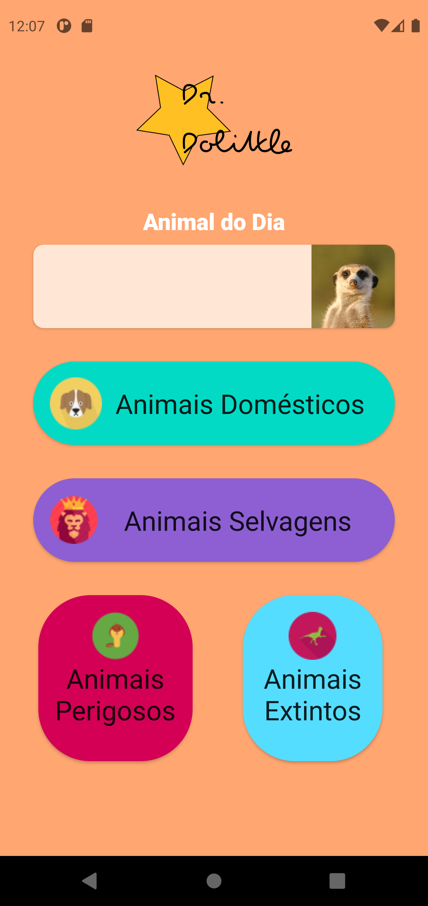
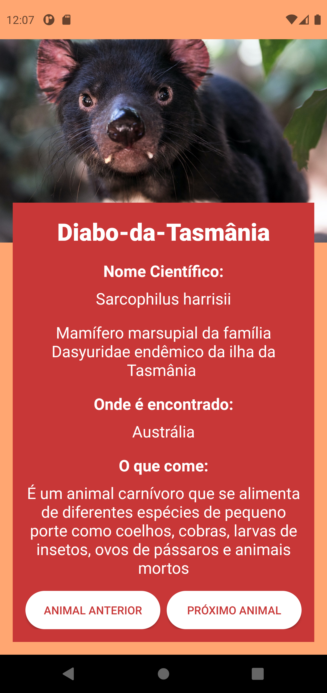

## DrDolittle

### Objetivos

DrDolittle é um aplicativo que exibe uma lista de animais que podem 
tem o objetivo de apresentar a crianças diversos animais categorizados em diversas categorias. Com ele é possível descobrir diversas curiosidades sobre os animais e seu modo de vida.

### Features

- [x] Consulta dos animais existentes no banco de dados
- [ ] Realizar o login para gerenciamento do app
- [ ] Cadastrar novos animais
- [ ] Alterar dados de animais existentes
- [ ] Remover animais existentes

### Tecnologias Utilizadas
<ul>
  <li><b>Firebase Realtime Database</b> para persistência de dados</li>
  <li><b>Firebase Storage</b> para armazenamento de imagens</li>
  <li><b>Firebase Authentication</b> para realização de login pelo administrador</li>
</ul>

### Demonstração do app

  <kbd>
    
  </kbd>
  &nbsp;&nbsp;&nbsp;&nbsp;
  <kbd>
    
  </kbd>
  &nbsp;&nbsp;&nbsp;&nbsp;
  

### Autor

 

Feito com carinho por Joanderson Gonçalves =]

